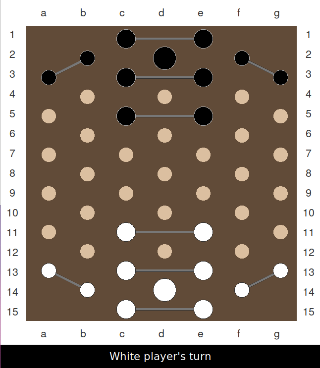
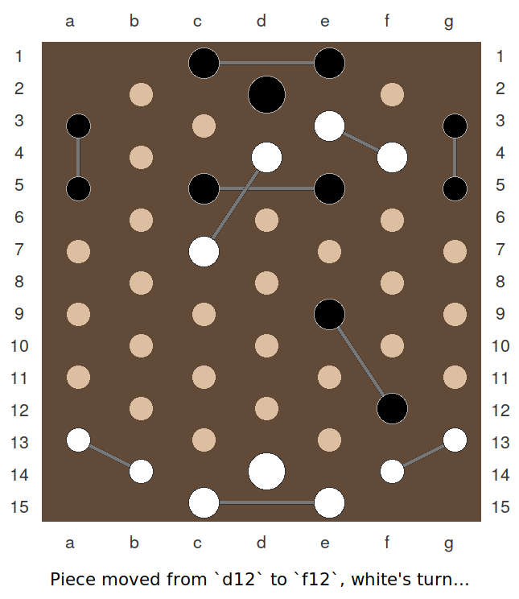

# eclipse-python
Alpha beta pruning method for board game Eclipse (by Gigamic) written purely in python. 

    
    

## Usage

``python main.py <time-sec> [white|black]``

## Additional Notes

* Computation is currently fixed to a depth of three moves rather, dynamic depth with 
Montecarlo search will be added in the future.
* Turn time exhaustion will simply break the recursion with its current max.
* Parallel tree traversing will be added.
